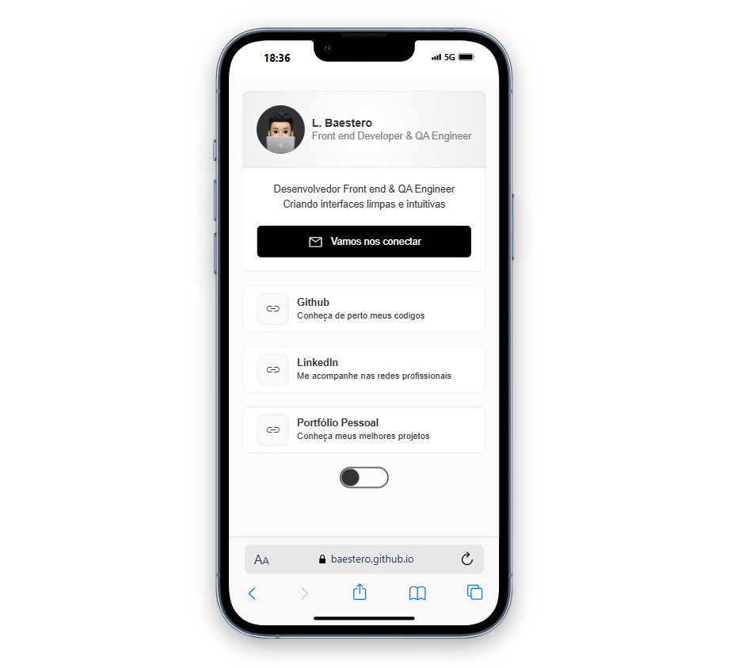

# Meu Card de Links

Criei meu próprio card de links para facilitar o contato e o acesso ao meu portfólio. O projeto foi desenvolvido utilizando apenas **HTML**, **CSS** e **JavaScript**.

## 🔗 Acesse o projeto

[https://baestero.github.io/card-pessoal/](https://baestero.github.io/card-pessoal/)

## 🛠 Tecnologias

- HTML5
- CSS3
- JavaScript (Vanilla)

## 🧪 Como executar localmente

1. Clone o repositório:

   ```bash
   git clone https://github.com/baestero/card-pessoal.git
   ```

2. Acesse a pasta do projeto:

   ```bash
   cd card-pessoal
   ```

3. Abra o `index.html` no navegador.

## 🖼 Preview



## 👨‍💻 Autor

Feito com por **Leonardo Baestero**
[GitHub](https://github.com/baestero)
